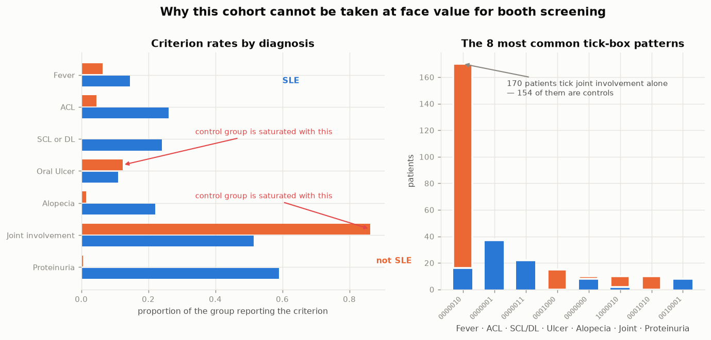
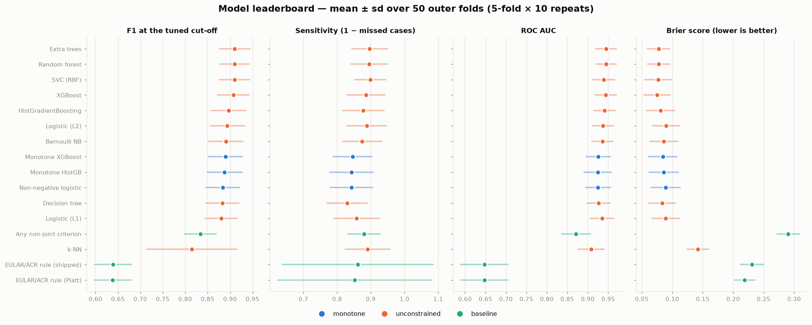
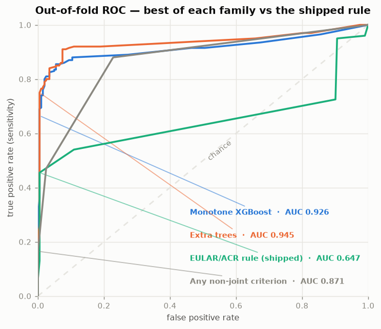
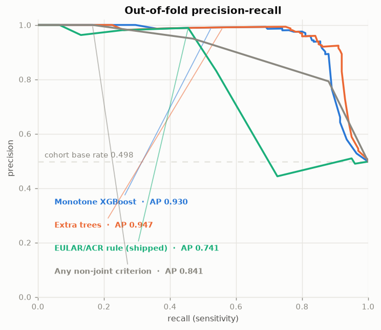
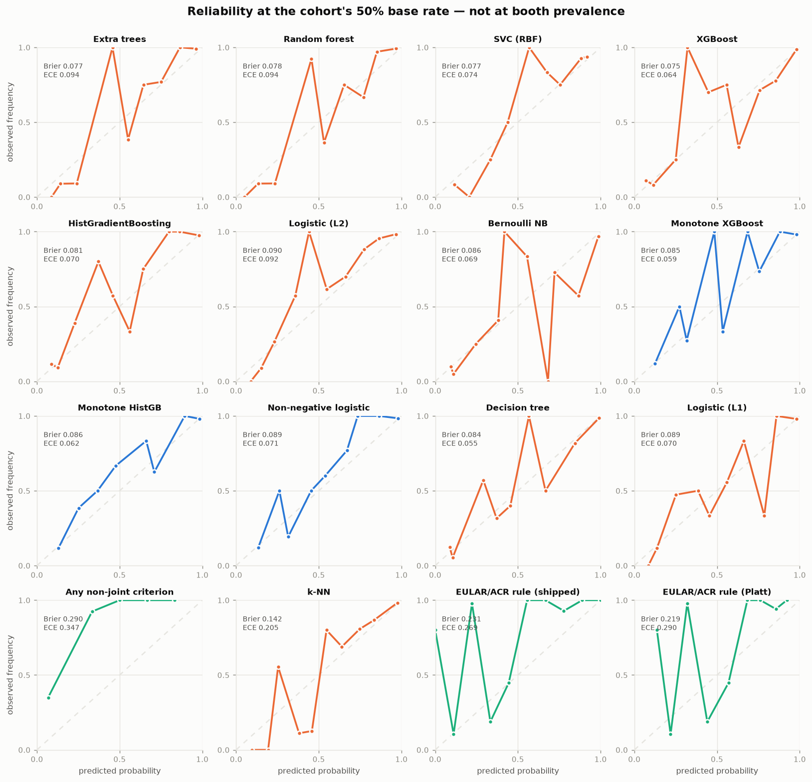
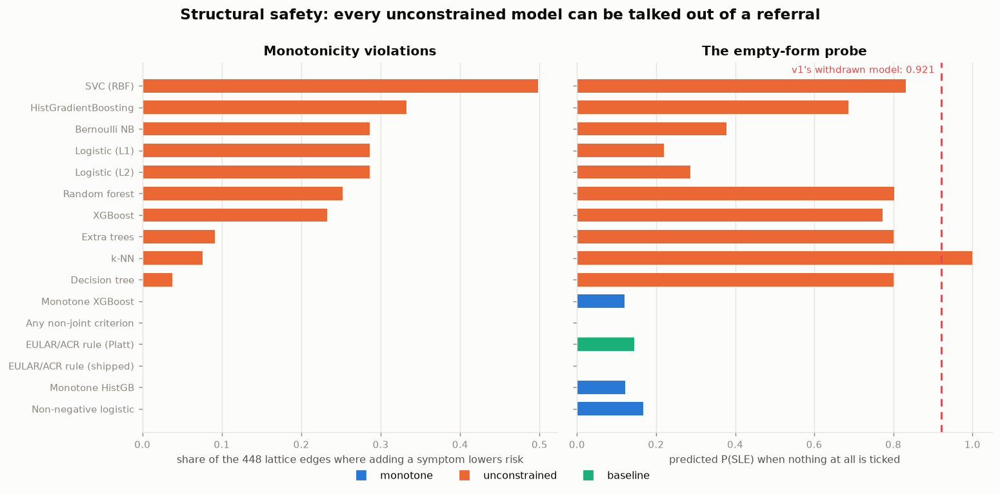
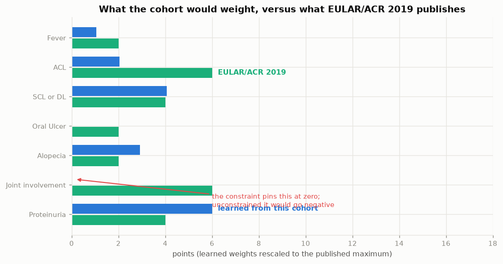
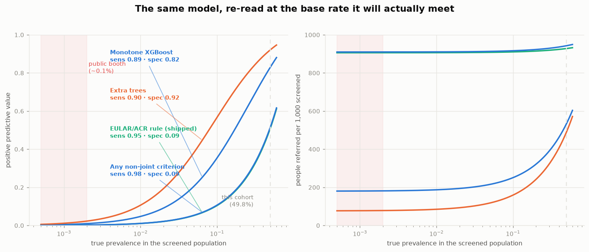

# Which model should screen the seven criteria?

Bakeoff of 16 models over `SLE_NotSLE.csv` (402 patients, 200 SLE / 202 not), restricted to the
seven observable criteria the app collects. Nested repeated stratified 5-fold cross-validation,
50 outer folds, thresholds and hyperparameters both chosen inside the training fold.

Reproduce with `exp/.venv/bin/python exp/run_experiment.py` — see [README.md](README.md).

---

## Answer

**Recommended: monotone-constrained gradient boosting** (`Monotone XGBoost`, or
`Monotone HistGB` — they are indistinguishable). F1 **0.890**, ROC AUC **0.926**, Brier
**0.085**, ECE **0.059**, and **zero** monotonicity violations across all 128 possible inputs.

**Ceiling, for reference:** the best unconstrained model (`Extra trees`, or equally
`Random forest` / `SVC`) reaches F1 **0.910** and AUC **0.945**. Monotonicity costs about
**2 points of F1** and **5 points of sensitivity** — and *buys* better calibration
(ECE 0.059 vs 0.094).

**Both are far better than what the app ships.** The current EULAR/ACR restricted rule scores
F1 **0.639** and AUC **0.647** on this cohort — worse than the trivial rule "flag anyone with any
criterion other than joint involvement" (F1 0.834, AUC 0.871).

**But — and this decides the matter — none of these numbers transfer to a public booth.** The
control group is 202 other sick hospital patients, not healthy walk-ins. Section 4 sets out what
that breaks and what it does not.

---

## 1. The cohort, before any modelling

| criterion | P(present \| SLE) | P(present \| not SLE) | empirical OR |
|---|---:|---:|---:|
| Proteinuria | 0.590 | 0.005 | 193 |
| SCL or DL | 0.240 | **0.000** | ∞ (quasi-separated) |
| ACL | 0.260 | 0.045 | 7.2 |
| Alopecia | 0.220 | 0.015 | 16.2 |
| Fever | 0.145 | 0.064 | 2.4 |
| Oral Ulcer | 0.110 | 0.124 | **0.88** |
| Joint involvement | 0.515 | 0.861 | **0.17** |

Two criteria run backwards. Joint involvement — worth **+6** in the published EULAR/ACR
instrument, tied for the heaviest weight — is *commoner in the controls than in the cases*, because
170 of the 402 patients present as joint-involvement-only and 154 of those are controls. The
control arm is a rheumatology comparison group, and this is what it looks like.

Two more facts bound everything downstream:

- **Bayes-optimal accuracy on these seven fields is 0.9303.** 252 of 402 patients fall into 9
  tick-box patterns that contain both classes. No model, however complex, can exceed this; a run
  that does is leaking and `run_experiment.check_anchors` aborts.
- **The empty pattern is 8/10 SLE.** Ten patients tick nothing at all and eight of them have lupus,
  diagnosed on serology the booth cannot see. This is the source of v1's notorious 0.921.

---

## 2. Leaderboard

Mean over 50 outer folds; `sd` is across folds. Sorted by F1, the stated first priority.

| model | family | F1 | sens | spec | ROC AUC | PR AUC | Brier | ECE | viol. |
|---|---|---:|---:|---:|---:|---:|---:|---:|---:|
| Extra trees | unconstrained | **0.910** ±.034 | 0.897 | 0.928 | 0.945 | 0.947 | 0.077 | 0.094 | 41 |
| Random forest | unconstrained | 0.910 ±.033 | 0.895 | 0.930 | 0.944 | 0.946 | 0.078 | 0.094 | 113 |
| SVC (RBF) | unconstrained | 0.910 ±.034 | 0.898 | 0.925 | 0.939 | 0.934 | 0.077 | 0.074 | 223 |
| XGBoost | unconstrained | 0.907 ±.035 | 0.885 | 0.935 | 0.944 | 0.943 | 0.075 | 0.064 | 104 |
| HistGradientBoosting | unconstrained | 0.897 ±.038 | 0.878 | 0.921 | 0.941 | 0.942 | 0.081 | 0.070 | 149 |
| Logistic (L2) | unconstrained | 0.894 ±.038 | 0.887 | 0.903 | 0.937 | 0.939 | 0.090 | 0.092 | 128 |
| Bernoulli NB | unconstrained | 0.891 ±.038 | 0.875 | 0.912 | 0.936 | 0.938 | 0.086 | 0.069 | 128 |
| **Monotone XGBoost** | **monotone** | **0.890** ±.038 | 0.846 | 0.947 | 0.926 | 0.930 | 0.085 | **0.059** | **0** |
| **Monotone HistGB** | **monotone** | 0.888 ±.039 | 0.843 | 0.947 | 0.925 | 0.929 | 0.086 | 0.062 | **0** |
| **Non-negative logistic** | **monotone** | 0.884 ±.037 | 0.843 | 0.938 | 0.925 | 0.928 | 0.089 | 0.071 | **0** |
| Decision tree | unconstrained | 0.883 ±.037 | 0.830 | 0.952 | 0.927 | 0.923 | 0.084 | 0.055 | 17 |
| Logistic (L1) | unconstrained | 0.881 ±.036 | 0.858 | 0.912 | 0.935 | 0.939 | 0.089 | 0.070 | 128 |
| *Any non-joint criterion* | *baseline* | 0.834 ±.035 | 0.880 | 0.772 | 0.871 | 0.841 | 0.290 | 0.347 | 0 |
| k-NN | unconstrained | 0.815 ±.101 | 0.890 | 0.661 | 0.908 | 0.915 | 0.142 | 0.205 | 34 |
| *EULAR/ACR rule (shipped)* | *baseline* | **0.639** ±.041 | 0.862 | **0.205** | **0.647** | 0.741 | 0.231 | 0.269 | 0 |
| *EULAR/ACR rule (Platt)* | *baseline* | 0.638 ±.041 | 0.852 | 0.224 | 0.647 | 0.741 | 0.219 | 0.290 | 0 |

**Adding sex and age changes nothing.** The `d9+demo` feature set moves the best F1 from 0.910 to
0.906 and the best AUC from 0.945 to 0.950 — inside fold noise. Age looks informative (SLE mean 38
vs control 50) but that gap is the age profile of a rheumatology control arm, not a property of
lupus. Keep the demographics optional, as the app already has them.

### Why the shipped rule scores so badly here

Its AUC of 0.647 is not a coding error. The rule gives joint involvement +6, which lands 160 of the
202 controls at exactly 6 points — the yellow band. At its ≥6 cut-off it flags 86% of cases and 80%
of controls: specificity **0.205**. On this cohort it is close to a coin toss, entirely because it
weights the one criterion that runs backwards here.

That is an indictment of the cohort as much as of the rule. The published weights were derived
against a mixed comparison group; this control arm is not that.

---

## 3. Calibration

Calibration was the second priority and it does not force a trade-off — the recommended model wins
it. `Monotone XGBoost` has the lowest ECE of any strong model (**0.059**, vs 0.094 for both
`Extra trees` and `Random forest`) and a Brier score within 0.008 of the best.

Both rule baselines are badly calibrated (ECE 0.269 / 0.347). Platt-scaling the rule fixes the
Brier a little (0.231 → 0.219) and cannot fix the ranking at all — AUC is unchanged at 0.647,
because a monotone rescaling cannot reorder anyone.

### Head to head, paired over the same 50 folds

| metric | Extra trees | Monotone XGBoost | difference |
|---|---:|---:|---:|
| F1 | 0.9103 | 0.8903 | −0.0200 |
| sensitivity | 0.8965 | 0.8460 | −0.0505 |
| ROC AUC | 0.9447 | 0.9258 | −0.0189 |
| Brier | 0.0774 | 0.0845 | +0.0072 |
| **ECE** | 0.0938 | **0.0594** | **−0.0344** |

The gaps are consistent across folds rather than noise (see `results/head_to_head.csv`; the
signed-rank p-values there are optimistic, because repeated k-fold reuses rows across repeats, so
read the effect sizes). The trade is real and small: give up 2 points of F1 and 5 of sensitivity,
get better calibration and the structural guarantee below.

---

## 4. Why the leaderboard is not the decision

### 4.1 Every unconstrained model can be argued out of a referral

Enumerating all 128 tick-box states and every one-symptom edge between them:

| model | violating edges | worst case observed |
|---|---:|---|
| SVC (RBF) | 223 / 448 (50%) | adding *joint involvement*: 0.832 → 0.115 |
| HistGradientBoosting | 149 (33%) | adding *oral ulcer*: 0.686 → 0.082 |
| Logistic (L2 / L1), Bernoulli NB | 128 (29%) | adding *joint involvement*: 0.585 → 0.397 |
| Random forest | 113 (25%) | adding *oral ulcer*: **0.802 → 0.000** |
| XGBoost | 104 (23%) | adding *oral ulcer*: 0.772 → 0.022 |
| Extra trees | 41 (9%) | adding *oral ulcer*: 0.800 → 0.000 |
| Decision tree | 17 (4%) | adding *ACL*: 1.000 → 0.000 |
| **all three monotone models** | **0** | — |

Read the Random forest row as a booth interaction: a visitor is told 80% risk, mentions they also
have a mouth ulcer, and is told 0%. That is not a defensible screening tool no matter what its F1
is, and it is the same defect that withdrew v1's model.

The empty-form probe tells the same story. With nothing ticked, `SVC` returns **0.832**, the tree
ensembles **0.77–0.80**, and `k-NN` **1.000** — against v1's withdrawn **0.921**. The monotone
models return **0.12–0.17**, and the shipped rule returns **0**. Every one of those unconstrained
numbers is a *correct* fit to a cohort where 8 of 10 symptom-free patients had lupus, and none of
them is usable on a walk-in.

### 4.2 What the constraint costs, in points

The non-negative logistic fit is the clearest view of what the cohort would do if allowed. Rescaled
onto the published 0–18 range:

| criterion | EULAR/ACR 2019 | learned from this cohort |
|---|---:|---:|
| Proteinuria | 4 | **6.0** |
| SCL or DL | 4 | 4.2 |
| Alopecia | 2 | 3.0 |
| ACL | 6 | **2.0** |
| Fever | 2 | 1.1 |
| Oral Ulcer | 2 | **0** (constraint binding) |
| Joint involvement | 6 | **0** (constraint binding) |

The constraint is doing real work on exactly the two criteria section 1 flagged. Unconstrained,
both would take negative weight.

### 4.3 The base rate, which nothing above accounts for

Sensitivity and specificity are properties of the test; predictive value is not. At the
sensitivity-floor operating point:

| model | sens | spec | PPV @ 50% | PPV @ 5% | PPV @ 1% | PPV @ 0.1% | referred per 1,000 @ 0.1% |
|---|---:|---:|---:|---:|---:|---:|---:|
| Extra trees | 0.90 | 0.92 | 0.92 | 0.38 | 0.106 | **0.012** | 77 |
| Monotone XGBoost | 0.89 | 0.82 | 0.83 | 0.21 | 0.047 | **0.005** | 181 |
| EULAR/ACR rule (shipped) | 0.95 | 0.09 | 0.51 | 0.05 | 0.011 | **0.001** | **906** |

At a public booth (~0.1% prevalence) the best model refers 77 people per 1,000 to find roughly one
case in 86 referrals; the shipped rule refers **906 per 1,000**, which is not screening. That
ranking is the one solid, transferable conclusion in this section.

The PPV values themselves are not. They are computed from sensitivity and specificity measured
against *this* control group. Booth attendees are not rheumatology patients, so the real specificity
is unknown — plausibly higher, since healthy people tick fewer boxes, but unmeasured. Treat the
column as an order of magnitude, not a number.

---

## 5. What to do

**Do not deploy any of these models to the public booth on this data.** Not because they fit
badly — they fit this cohort well — but because they were fitted against the wrong comparison
group. `core.py` already reaches that conclusion for v1's model; this bakeoff confirms it holds for
every model family, and quantifies it.

**Keep the EULAR/ACR rule for now.** Its AUC of 0.647 here is a measurement against a control arm
that does not represent booth attendees. It is monotone, scores 0 on an empty form, and is citable.
Its poor showing is a reason to seek better data, not a reason to swap in a model whose failure mode
is worse.

**If the tool is instead pointed at clinic pre-lab triage** — patients already symptomatic, being
considered for the full panel, i.e. the population this cohort actually samples — then
`Monotone XGBoost` is a defensible replacement for the rule and would be a large improvement
(F1 0.890 vs 0.639, AUC 0.926 vs 0.647). It would need to pass the monotonicity property in
`tests/test_core.py:110-143`, which by construction it does.

**What would settle the booth question:** a consecutive sample of booth attendees with the seven
criteria recorded and a real diagnostic follow-up, including the people who tick nothing. Even a few
hundred rows would fix the two things this cohort cannot: the direction of joint involvement, and
the intercept. The app already logs exactly these seven fields per submission
(`storage.build_header`), so the collection mechanism exists.

**Reconsider the yellow band regardless.** `core.BAND_YELLOW = 6` is marked provisional. On any
population, joint involvement alone reaches 6 and triggers a referral. Whether that is right is a
clinical call, but it is the single decision that most determines the referral volume.

---

## Files

| output | contents |
|---|---|
| `results/summary.csv` | Full leaderboard, both feature sets, mean and sd for every metric |
| `results/cv_metrics.csv` | Raw per-fold metrics — 50 folds × 16 models × 2 feature sets |
| `results/head_to_head.csv` | Paired fold-by-fold comparisons |
| `results/monotonicity.csv` | Violation counts, worst drop, empty-form probability |
| `results/ppv_by_prevalence.csv` | Operating points re-expressed at five base rates |
| `results/separation.csv` | Class-conditional rates and quasi-separation flags |
| `results/effect_directions.csv` | Coefficients, odds ratios, permutation importance |
| `figures/` | The nine figures above |
